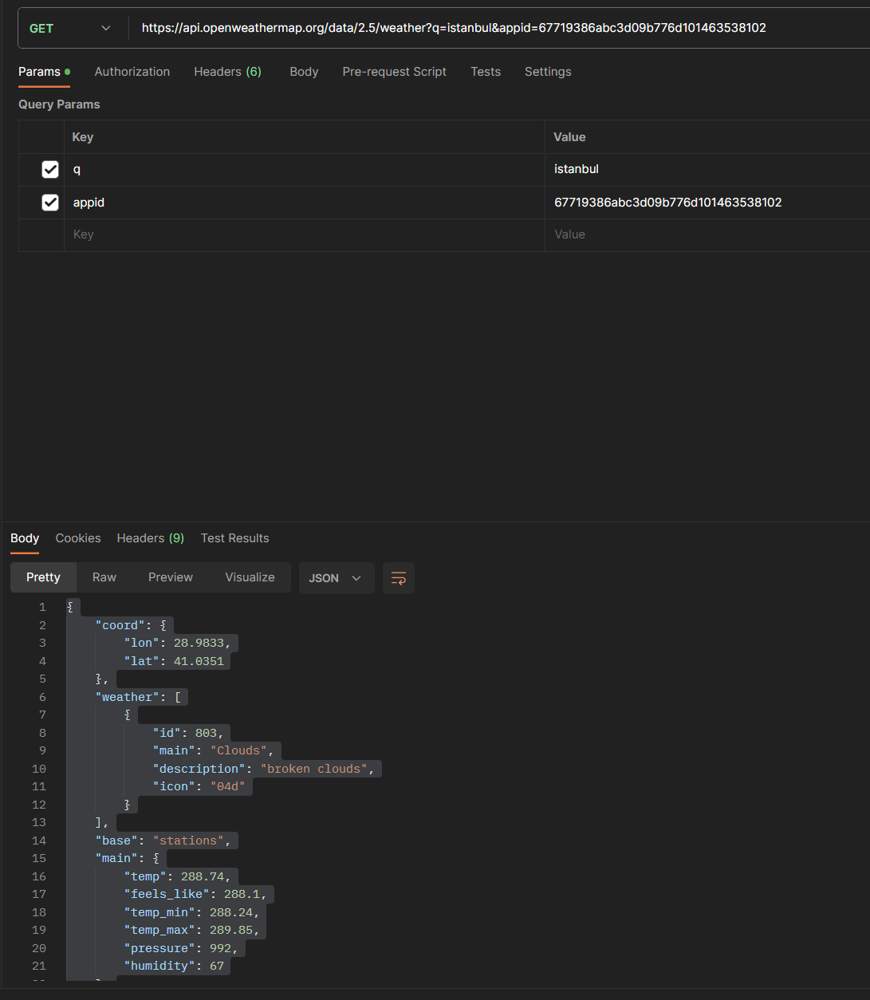
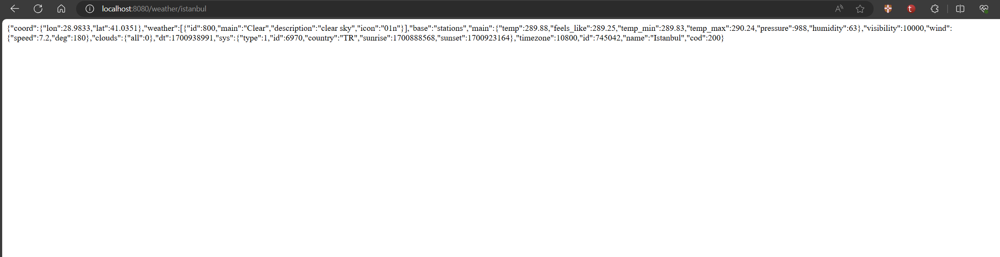
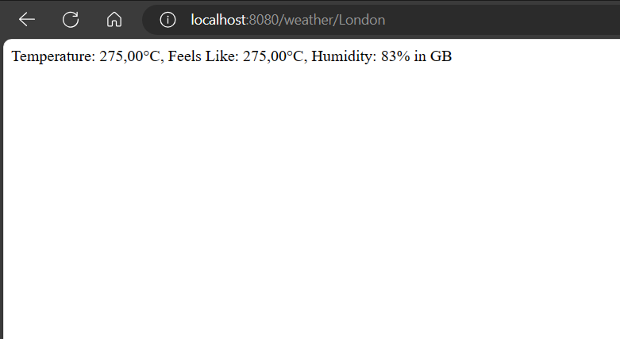
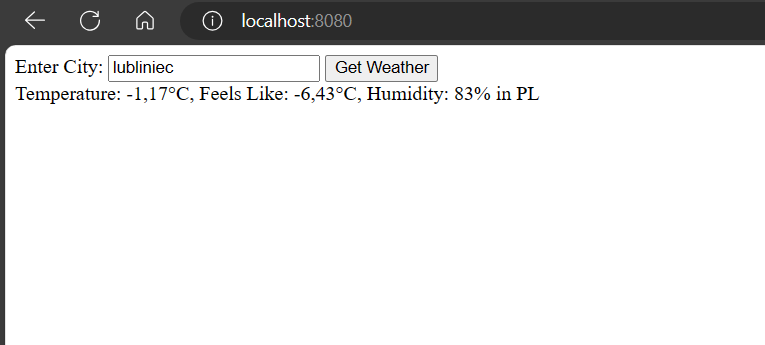
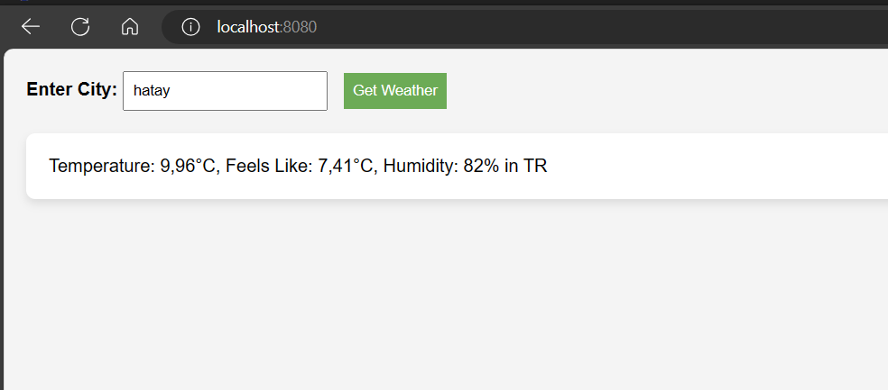

# OpenWeatherApi

key: 67719386abc3d09b776d101463538102

https://api.openweathermap.org/data/2.5/weather?q=istanbul&appid=67719386abc3d09b776d101463538102

we will get the city name as parameter: e.g.: istanbul
Using postman here lets try out if the get api url works.

Firstly, lets set up api call well and get the data on the web.

Secondly, temp, feels-like, humidity infos distinguished and parsed readable

Thirdly, we can get the output with our input city text and as a response temperature
information in metric system.

added style css for index and weather

